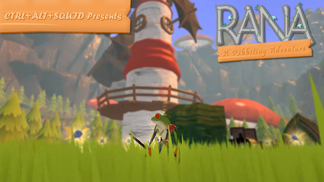
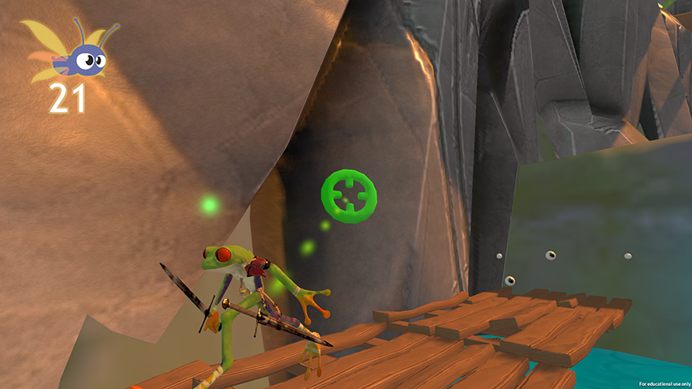
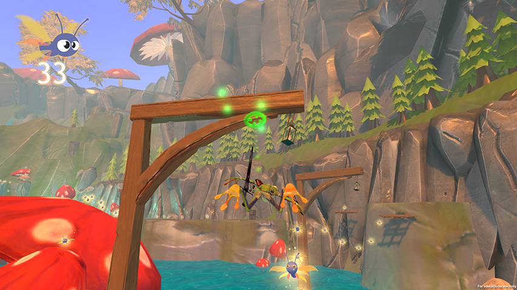
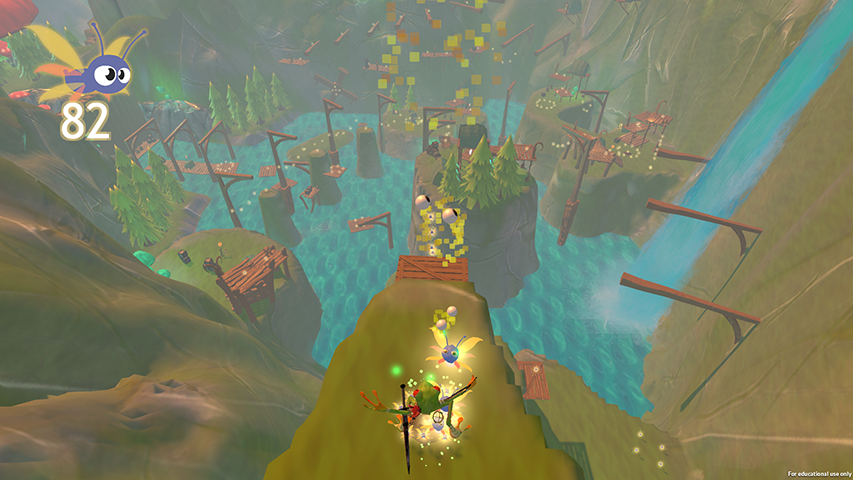
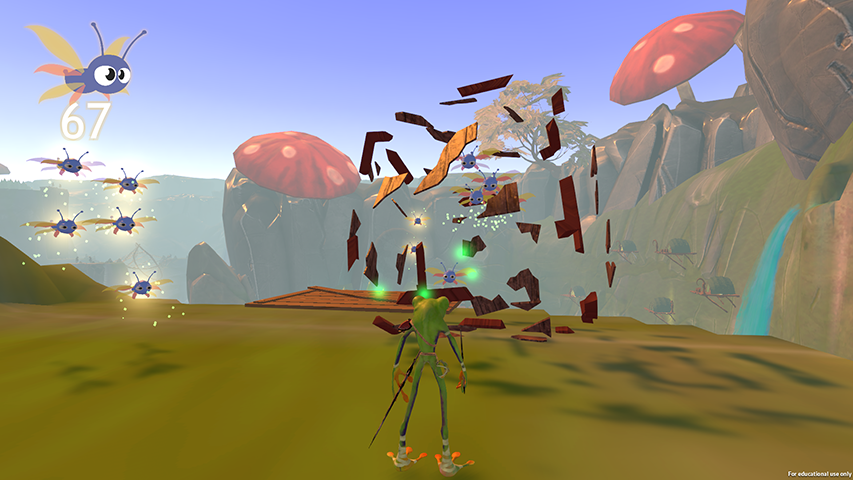
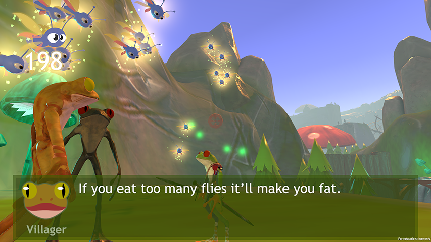
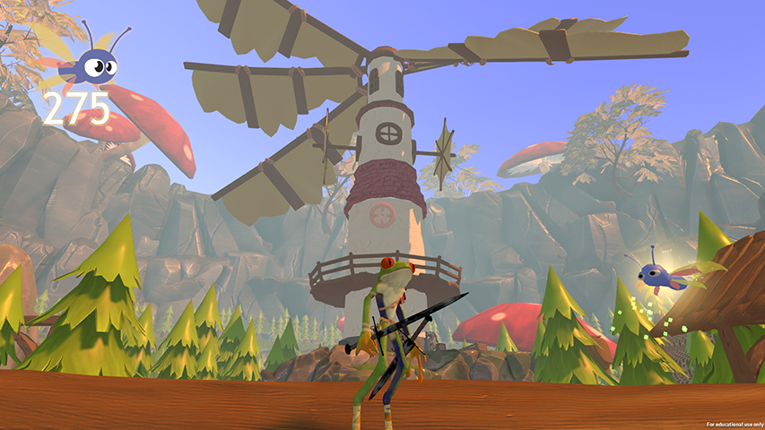
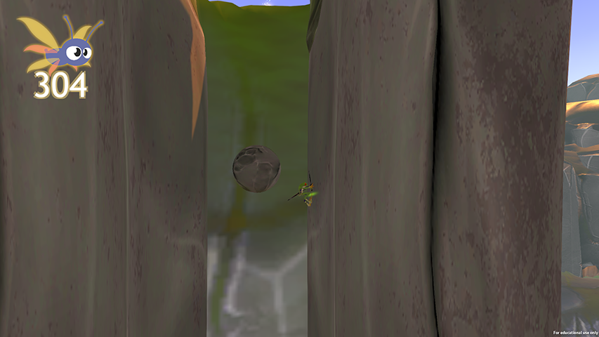
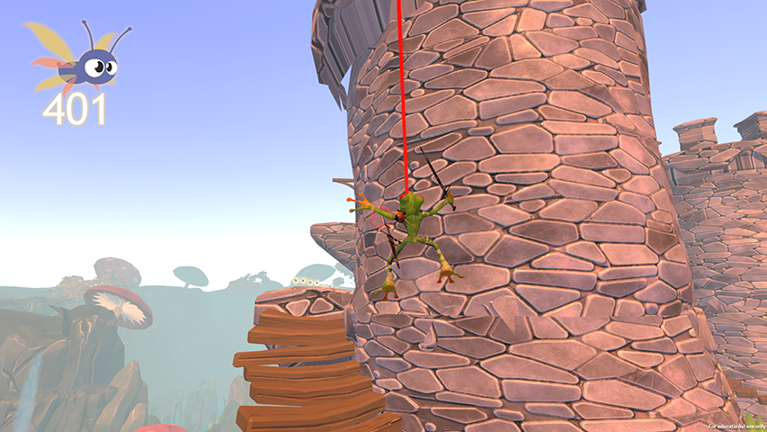

# Rana: A Ribbiting Adventure
[VIDEO GOES HERE?]

# Assignment requirements
(b) The game is adequately described;

(a) The press kit is available online;
(b) The development team are introduced and credited for their work;
(c) Key flavour text and unique selling points are included;
(d) The aesthetic is illustrated with at least four screenshots;
(e) The core game mechanics are illustrated with at least one video.

## Overview
[a paper scroll background for this segment would be cool!]
Awaken, young prince. What are you doing down here?

Lo, your castle stands afar... for it seems the **MEGA KITTEN** got the better of you when she attacked your kingdom with her army of vicious cats. 

But fret not, my prince! You are not alone. With your new reluctant ally, **Sword** the Talking Sword, and your renowned **tongue swinging** ability, I'm sure you will return to your castle with plenty of time to defeat the **MEGA KITTEN** before sunset.

We pray for your victory, for if she is allowed to reign over your kingdom for long, we will surely all be eaten.

## Gameplay
Rana is an action-adventure platformer for PC. You play as the titular Rana, a frog prince kicked out of his castle by an adorable, evil feline. With your talking sword buddy and highly versatile tongue, you will hop, swing, slash and crash your way through a beautiful fantasy environment.

Your goal is simple: you must return to your castle before dinnertime to defeat the evil **MEGA KITTEN**. Along the way, your precision frogging skills will be tested by the treacherous rivers, piranhas, grumpy bugs, ruthless cat minions... and more deadly hazards!

## Gallery
*Click an image to enlarge it!*

# Team (new)
*Rana: A Ribbiting Adventure* is brought to you.

Coming May 2019!

# Team (old)
## Louis Foy
Hello! My name is Louis and I'm a programmer on this project. My primary jobs included programming the core mechanics, many of the hazards and interactables, and silky smooth grass engine. In addition, I play a supportive role in the technological department, working diligently to ensure the game is on track and that every team member understands how to incorporate their work.

In the first few sprints, I was also scrum master for the team, playing a pivotal role in establishing the direction of the game. This included:

* Running brainstorming sessions
* Determining the tasks required for each role
* Organising stand-up times and sending reminders to the team

After a few weeks, I stepped down from this position to instead focus on applying my programming skills, feeling that my assertive communication skills were not ready to address difficult team scenarios such as low attendance.

Platformers are a specialty of mine. The influence of my favourite platformers on the game is no secret to the team. My inspirations enable me to deliver silky-smooth and responsive character controls and provide useful feedback and ideas to the team.